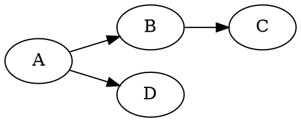
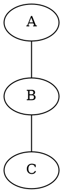
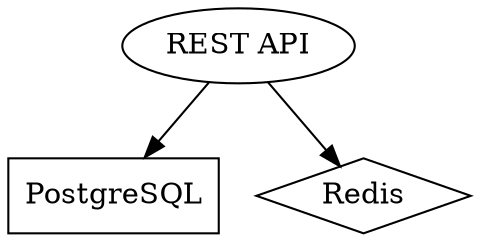
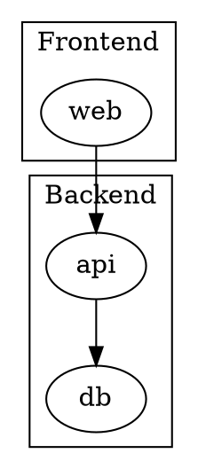

# ASCII Diagrams

Render ASCII box-art diagrams from Graphviz DOT source using the bundled `scripts/dot_to_ascii.py`.

## Quick Start

```bash
python3 scripts/dot_to_ascii.py 'digraph { a -> b -> c }'
```

Output uses Unicode box-drawing characters by default. For plain ASCII, use the library API with `fancy=False`.

## Workflow

1. Translate the user's request into valid Graphviz DOT source.
2. Run the script to render it.
3. Show the ASCII output to the user. If the layout looks off, adjust the DOT source (node order, ranks, edge direction) and re-render.

### Running the Script

```bash
# From a shell — pass DOT as an argument:
python3 <skill_path>/scripts/dot_to_ascii.py 'digraph { a -> b -> c }'

# Or pipe it in:
echo 'digraph { a -> b -> c }' | python3 <skill_path>/scripts/dot_to_ascii.py
```

Replace `<skill_path>` with the actual path to this skill's directory.

**First run** bootstraps graph-easy into `~/.cache/graph-easy/` (requires `perl` and `curl`).

## DOT Syntax Essentials

### Directed graph



### Undirected graph



### Node labels and shapes



Common shapes: `box`, `ellipse`, `diamond`, `circle`, `plaintext`, `record`.

### Subgraphs (clusters)



### Layout tips

- Use `rankdir=LR` for wide, horizontal diagrams.
- Use `{ rank=same; A; B; }` to force nodes onto the same row.
- Keep node names short — graph-easy renders fixed-width boxes, so long labels can distort alignment.
- Prefer simple, shallow graphs. Deeply nested clusters or >15 nodes may produce cluttered output.
- If layout is poor, try reordering edges or switching `rankdir`.

## Resources

### scripts/

- **dot_to_ascii.py** — Self-contained converter. Accepts a DOT string as a CLI argument or on stdin, prints ASCII art to stdout.
