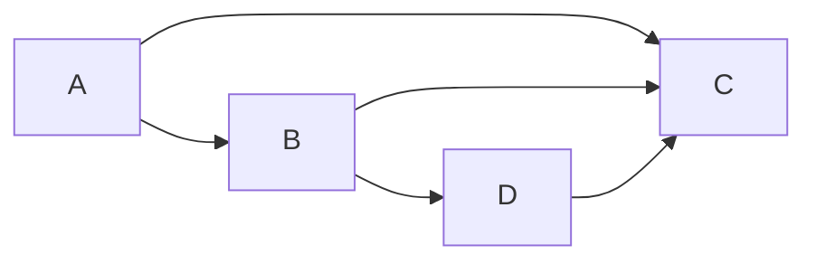
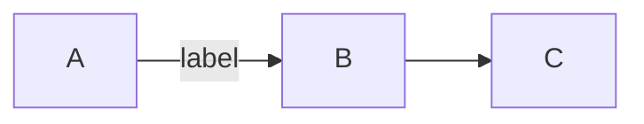
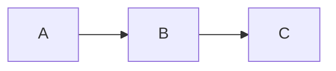
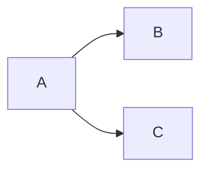
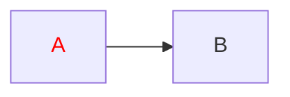
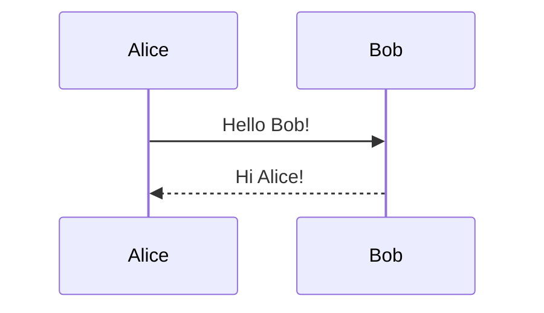

# Mermaid ASCII Diagrams

Render ASCII diagrams from Mermaid syntax using `mermaid-ascii`.

## Quick Start

```bash
echo 'graph LR
A --> B --> C' | mermaid-ascii
```

## Workflow

1. Translate the user's request into valid Mermaid syntax.
2. Write the mermaid code to a temporary file or pipe it to `mermaid-ascii`.
3. Show the ASCII output to the user. If the layout looks off, adjust the Mermaid source and re-render.

### Running the Tool

```bash
# Pipe mermaid code directly:
echo 'graph LR
A --> B --> C' | mermaid-ascii

# Or use a file:
mermaid-ascii -f diagram.mermaid

# With options:
echo 'graph LR
A --> B' | mermaid-ascii -x 8 -p 2
```

## Supported Diagram Types

### Graph / Flowchart



Directions: `LR` (left-to-right), `TD` (top-down).

#### Labeled edges



#### Multiple arrows on one line



#### `A & B` syntax



#### Colored output with `classDef`



### Sequence Diagrams



- Solid arrows: `->>`
- Dotted arrows: `-->>`
- Self-messages: `A->>A: Think`
- Participant declarations: `participant A as Alice`

## CLI Options

| Flag | Description | Default |
|---|---|---|
| `-f, --file` | Mermaid file to parse | stdin |
| `-x, --paddingX` | Horizontal space between nodes | 5 |
| `-y, --paddingY` | Vertical space between nodes | 5 |
| `-p, --borderPadding` | Padding between text and border | 1 |
| `--ascii` | Use only ASCII characters (no Unicode box-drawing) | false |
| `-c, --coords` | Show grid coordinates | false |
| `-v, --verbose` | Verbose output | false |

## Layout Tips

- Use `graph LR` for wide horizontal diagrams, `graph TD` for vertical ones.
- Keep node names short — long labels can distort alignment.
- Use `-x` to increase horizontal spacing if nodes overlap.
- Use `-p` to increase box padding for readability.
- For plain ASCII (no Unicode), add `--ascii`.
- Prefer simple graphs. Very complex graphs (>15 nodes) may produce cluttered output.

## Limitations

- No `subgraph` support yet.
- Only rectangle shapes.
- No diagonal arrows.
- Sequence diagrams don't support activation boxes, notes, or loop/alt/opt blocks.
